# SLIPGATE — dependency graph and execution state

Every open item, its dependencies, its lane. Nodes carry the numbering from
the session inventory. Status: [D]=done, [R]=running now, [A]=agent building,
[B]=blocked on arrow, [Q]=queued, [?]=needs owner ruling.

```mermaid
graph TD
    subgraph GENERATOR["RUNE generator (sg_rune.c — main line)"
        ]
        G0["gravity in oracle phantoms [D]<br/>(the levitation bug: pms.gravity=0)"]
        N1["1 drop links [D] (6977 in 50k rune)"]
        N2["2 hook climb anchors [D] (11850)"]
        N3["3 swim volume seeds [D]<br/>lmctf01: 65129 SWIM links, smap05: 11744<br/>(lmctf03 simply has no water);<br/>in-play swim still unobserved"]
        N4["4 lift links (func_plat) [D]"]
        N5["5 teleporter links [D]"]
        N6["6 south-strip one-way pairs [D] (dissolved by rebuild: frontier 2)"]
        N8["8 entry envelopes populated [D]"]
    end

    subgraph COVERAGE["The gate"]
        N7["7 coverage >90% both flags [D]<br/>99.8% both (1533/1536), in-engine"]
    end

    subgraph BODY["ARACHNOTRON (sg_arach.c + sg_combat.c)"]
        N10["10 movement policy port [D] (strafe live 82/1204)"]
        N11["11 hook execution verified [D-fires]<br/>66 fires; catch/convert rate pending;<br/>Rune oscillates anchors y≈-1790"]
        N12["12 drop-lip execution verified [B]"]
        N13["13 combat module [D]"]
        N14["14 precision braking [D] (in 10)"]
        N15["15 weight sweeps [Q]"]
        N16["16 per-item detour fields [Q]"]
        N17["17 escort + recover roles [Q]"]
    end

    subgraph EYE["CACO (sg_caco.c)"]
        N18["18 team callouts [D]"]
        N19["19 human sightings feed belief [D]"]
        N20["20 staleness advection [D]<br/>full reachable-set projection [D]"]
        N21["21 rune/quad state via belief [D]<br/>(wired into sg_fields.c, r190)"]
    end

    subgraph SYSTEM["System"]
        N22["22 FIRST STEAL [D] match 11:<br/>'Phase[SG] stole the red flag.'<br/>carried 500u hooking, died to Field.<br/>FIRST CAPTURE still open"]
        N23["23 A/B vs legacy 289/5.3 [B]<br/>(script [A]; RUNS blocked on freeze)"]
        N24["24 multi-map validation [B]"]
        N25["25 batch rune generation [A]"]
        N26["26 learning (costs, links, danger, weights) [Q]"]
        N27["27 commit everything since a1821db [B]"]
        FREEZE["integration freeze [D]:<br/>all agents merged, r190~a1821db built,<br/>deployed md5 8626935…; verification match pending"]
        TOOL["runeview tool [D]"]
    end

    subgraph MAIN["outside SLIPGATE (not this plan's work)"]
        N28["28 toss flag NULL [?] owner ruling — LMCTF change"]
    end
    %% Legacy-botlib items (bspc/aas, blocked-fire) removed: the old system
    %% is only the A/B control. Nothing legacy is SLIPGATE work.

    G0 --> N1
    G0 --> N8
    N1 --> N7
    N2 --> N7
    N3 --> N7
    N4 --> N7
    N5 --> N7
    N6 -. minor .-> N7
    N7 --> N22
    N10 --> FREEZE
    N13 --> FREEZE
    N18 --> FREEZE
    N19 --> FREEZE
    N20 --> FREEZE
    N3 --> FREEZE
    N4 --> FREEZE
    N5 --> FREEZE
    FREEZE --> N11
    FREEZE --> N12
    FREEZE --> N27
    N7 --> N23
    FREEZE --> N23
    N22 --> N23
    N23 --> N15
    N15 --> N24
    N25 --> N24
    N7 --> N24
    N24 --> N26
    N8 --> N26
    N21 --> N15
    N16 --> N15
    N17 --> N15
    TOOL -. verifies .-> N7
```



## Reading the graph

- **G0 (phantom gravity) is the root of the generator subtree.** pms.gravity
  was 0 from memset; every drop proof levitated, jumps flew away, four prover
  designs failed on top of one uninitialized short. Fix is one line, in the
  pipeline running now.
- **N7 (coverage) is the single gate to N22 (first steal)** — the project's
  definition of working. Nothing downstream of the freeze unblocks steals;
  only coverage does. Drops (N1) + hooks (N2) are expected to carry it;
  swim/lifts/teleporters (N3-5) mop up.
- **FREEZE**: agents finish → merge their tree state → one build → one md5
  deploy → verification match. A/B runs (N23) require BOTH coverage and the
  freeze — measuring a body under active rewrite is not a measurement.
- **Learning (N26) is last** by design: it adjusts costs and weights that
  must first exist and first be measured.

## Lane assignments right now

| lane | items | state |
|---|---|---|
| main line (this session) | verification match on r190, N22 diagnosis, N27 commit | match running (port 28431) |
| agents | N3-5, N10, N13-14, N18-21, scripts, runeview | ALL DONE, merged, built as r190 |
| blocked on server free | N23 A/B runs, N24/25 batch generation | scripts dry-run verified |
| owner | N28 ruling | waiting |

## Standing backlog (implement-all authorization, 2026-07-31)

In flight (agents): duel surface term + weave + corner prediction;
chat/personality/human orders (sg_chat); rocket-jump prover (generator).

Queued for integration the moment sg_arach.c frees:
- teammate avoidance: watch exempts teammate-blocks (door_held_last
  pattern); feelers lane-bias + sidestep on friendly obstruction.
  TOP PRIORITY: 5v5 shelves 204-278/match are bots billing body-blocks
  to innocent links.
- human-order role override: SG_Role consults SG_ChatOrderedRole /
  SG_ChatEscortTarget (API from the chat agent).
- rocket-jump body execution: aim anchor[0/1], fire at feet + jump,
  health-gated by anchor[2] cost vs current health+armor.

Found, not yet started:
- pmove-basis/aim coupling (duel agent's flag): on every engaged frame,
  combat overwrites cmd.angles AFTER the strafe solver built its basis
  from the navigation view, so pmove reconstructs a different direction
  than the one solved for -- the bot runs down its AIM, not its route.
  Pre-existing on all combat frames; the fix (rebuild basis from
  post-combat angles, re-decompose) changes tuned behavior everywhere,
  so it gets its own measured A/B, not a drive-by.
- skill model: per-bot aim error / reaction time / scatter ramp so
  bot_skill means something and the eight names play differently.
- swim/lift body fixes: whatever the lmctf01 observation match shows.
- campaign findings: whatever tools/campaign.sh (5 maps x 5 games)
  surfaces goes straight onto this list.

## Defect ledger

- FIXED (commit a47ae1c): hook climbs never topped out — body released at
  rope<200 unconditionally; prover releases near-destination or <130 then
  steers the fall (sg_rune.c:494-534). After: 109/115 hooks land at dest
  height; attacker closest approach 2091 → 141.
- FIXED (r191, pending verify): Trace frozen 96s emitting fwd=400 —
  Cmd_Unhook_f with the grapple as pers.weapon only forces -attack and
  never aborts (g_cmds.c:1448); the live rope's dead-stop overwrites
  velocity ~0 every frame (p_weapon.c:2099-2104) and p_client.c:2834
  zeroes gravity. Bot now releases via ctf_hook_abort directly + clears
  any rope it did not arm.
- FIXED (r191, pending verify): defenders ground fwd=400 into their post
  wall (Caco, 66s at spd=68). Hold inside 400ms of the stand, face the
  approach seed; combat owns the view when anyone shows.
- FIXED (r191 + rune regen, pending verify): Field orbited drop link
  11580 a full match — ProveDrop finds lips with POINT down-probes (a
  point slips past a railing a player box cannot) and never walked the
  seed→lip approach. Now the phantom walks the approach or the link is
  refused (dd_fenced counter). Body-side: any link chosen 4s with the bot
  inside a 96u ball is shelved 30s (SHELVE log) — kills every orbit class.
- RESOLVED (match 11): combat kills at route crossings confirmed (Field
  and Gate both killed the carrier). NOTE: matches 2-10 steal counts were
  read with a wrong grep ("got the" -- the game says "stole the",
  g_ctffunc.c:1028); recounted, all genuinely zero. abmatch.sh always had
  the right string.
- Door truth (telemetry, matches 8-11): every door on lmctf03 is
  TARGETED; triggers are one-sided (bd2: south only). Runtime answer:
  yield the swing arc, wait 2.5s, then treat as wall 30s and reroute
  (DEADDOOR). The generator's held-open links stay; the body routes
  around dead sides.
- OPEN: SWIM links 0 on lmctf03 — water seeding unexercised; needs a map
  with real water volumes (N24 batch will surface one).
- bspc rs_maxfallheight parser row preserved as
  bots/bspc/aas_cfg.c.rs_maxfallheight.patch; live copy only in the
  external Downloads tree.
```
