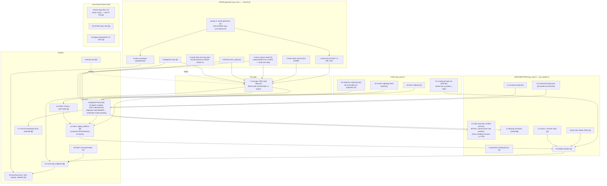

# SLIPGATE — dependency graph and execution state

Every open item, its dependencies, its lane. Nodes carry the numbering from
the session inventory. Status: [D]=done, [R]=running now, [A]=agent building,
[B]=blocked on arrow, [Q]=queued, [?]=needs owner ruling.



## Reading the graph

- **G0 (phantom gravity) is the root of the generator subtree.** pms.gravity
  was 0 from memset; every drop proof levitated, jumps flew away, four prover
  designs failed on top of one uninitialized short. Fix is one line, in the
  pipeline running now.
- **N7 (coverage) is the single gate to N22 (first steal)** — the project's
  definition of working. Nothing downstream of the freeze unblocks steals;
  only coverage does. Drops (N1) + hooks (N2) are expected to carry it;
  swim/lifts/teleporters (N3-5) mop up.
- **FREEZE**: agents finish → merge their tree state → one build → one md5
  deploy → verification match. A/B runs (N23) require BOTH coverage and the
  freeze — measuring a body under active rewrite is not a measurement.
- **Learning (N26) is last** by design: it adjusts costs and weights that
  must first exist and first be measured.

## Lane assignments right now

| lane | items | state |
|---|---|---|
| main line (this session) | verification match on r190, N22 diagnosis, N27 commit | match running (port 28431) |
| agents | N3-5, N10, N13-14, N18-21, scripts, runeview | ALL DONE, merged, built as r190 |
| blocked on server free | N23 A/B runs, N24/25 batch generation | scripts dry-run verified |
| owner | N28 ruling | waiting |

## Known defects on the board

- Rune[SG] hook-fires the same 4-5 anchors on y≈-1790 in a loop (fire →
  release → re-select). Not converting traversal into progress; closest
  flag approach in match so far ~2100u.
- SWIM links 0 on lmctf03 — water seeding unexercised; needs a map with
  real water volumes to verify (N24 batch will surface one).
- bspc rs_maxfallheight parser row lives outside the repo
  (Downloads tree aas_cfg.c:83) — needs vendoring or it dies with a
  cache clean.
```
